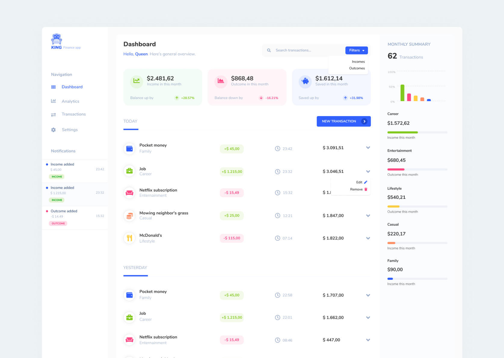

<p align="center">
  <a href="https://github.com/rawic/king">
    
  </a>

  <h3 align="center">King</h3>

  <p align="center">
    Personal Finance App.
    <br />
    Live demo comming soon.
  </p>
</p>

## About King app

<a align="center" href="https://invis.io/CZQAF2DKATX#/411094156_King" rel="nofollow noopener noreferrer" target="blank">
  
</a>

My first advanced project in React. It's still under development process. 
I regularly raise the difficulty level (e.g. First I implemented the Context API and then Redux)

More information about the project will be available soon.

### Installation

```sh
yarn
yarn start
```

### Built With

- [React](https://reactjs.org/)
- [Redux](https://redux.js.org/)
- [Storybook](https://storybook.js.org/)
- [Fort Awesome](https://fortawesome.com/)
- [styled-components](https://styled-components.com/)
- [Jest](https://jestjs.io/)
- [React Testing Library](https://testing-library.com/docs/react-testing-library/intro)
- [Figma](https://www.figma.com/)

## License

Distributed under the MIT License. See `LICENSE` for more information.

## Contact

Rafał Wichowski - [@rafalwichowski](https://twitter.com/rafalwichowski) - [hi@rawic.me](mailto:hi@rawic.me)

Project Link: [https://github.com/rawic/king](https://github.com/rawic/king)

[app-screenshot]: readme/app-screenshot.jpg
